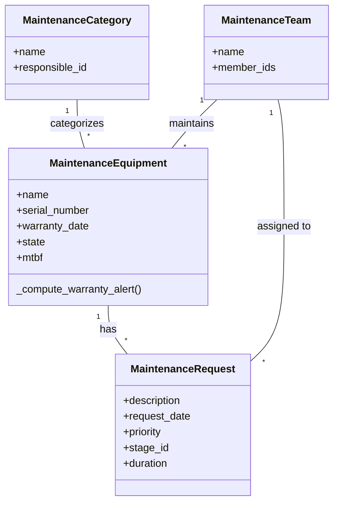

<div align="center">

# 🛡️ GearGuard
### The Ultimate Maintenance Tracker for Odoo

[](https://www.odoo.com)
[](https://www.gnu.org/licenses/lgpl-3.0.html)
[](https://github.com/psf/black)
[](http://makeapullrequest.com)

**Stop breakdowns before they happen. The intelligent asset guardian for your enterprise.**

[Features](#features) • [Installation](#installation) • [Architecture](#architecture) • [Contributing](#contributing)

</div>

---

## 🚀 Overview

**GearGuard** is a native Odoo module designed to transform how organizations handle facility management and asset maintenance. It moves beyond simple ticketing to provide a comprehensive lifecycle management system—from acquisition to scrap.

Whether you manage a fleet of vehicles, a factory floor of CNC machines, or office IT infrastructure, GearGuard ensures you never miss a maintenance window or a warranty expiration again.

## ✨ Features

- **🛡️ Smart Warranty Tracking**: Automatically calculates warranty status and triggers alerts 30 days before expiration. Visual indicators (Red/Yellow/Green) let you assess risk at a glance.
- **🔧 Kanban-Driven Workflows**: Manage maintenance requests with a modern, drag-and-drop Kanban board. Track stages from `New` → `In Progress` → `Repaired` → `Scrap`.
- **📊 Actionable Analytics**: Built-in computation for **MTBF** (Mean Time Between Failures), **Total Downtime**, and **Maintenance Costs**.
- **👥 Team & Technician Management**: Define maintenance teams (e.g., "Mechanics", "IT Support") and auto-assign requests based on equipment categories.
- **📱 Responsive Design**: Fully integrated with Odoo's web interface, accessible from desktop or mobile for technicians on the go.

## 🏗️ Architecture

GearGuard is built on standard Odoo models, ensuring seamless integration with `hr`, `mail`, and `base` modules.



## 🛠️ Installation

### Prerequisites
- Odoo 17.0 Community or Enterprise
- Python 3.10+

### Quick Start

1. **Clone the repository** into your Odoo addons path:
   ```bash
   cd /path/to/your/odoo/addons
   git clone https://github.com/ahadullabaig/gearguard.git
   ```

2. **Update your Odoo configuration** to include the new directory (if necessary).

3. **Install the module** via CLI:
   ```bash
   ./odoo-bin -c odoo.conf -d your_database -u gearguard --stop-after-init
   ```

4. **Or via the Web Interface**:
   - Go to **Apps**.
   - Click "Update App List".
   - Search for `GearGuard`.
   - Click **Activate**.

## 💻 Tech Stack

- **Backend**: Python 3, Odoo ORM
- **Frontend**: Odoo QWeb, XML, CSS
- **Database**: PostgreSQL

---

<div align="center">
    <small>Built with ❤️ by Ahad, Divisha, Charithra, and Anjali</small>
</div>
